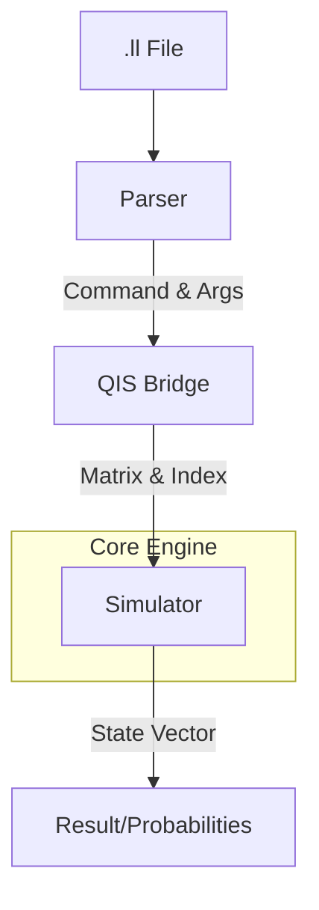

# qir-rust-interp

**A lightweight, zero-dependency QIR emulator and interpreter built in Rust.**

`qir-rust-interp` is a tool designed to execute Quantum Intermediate Representation (QIR) locally with ease. It aims to provide a fast development experience without requiring heavy dependencies like the LLVM toolchain or the full Azure Quantum SDK.

---

## 🚀 Concept & Motivation

### "Built by a learner, for learners."
I am currently a student of both Quantum Computing and the Rust programming language. During my journey, I encountered a significant barrier: the weight of setting up environments just to experiment with QIR.

This project was born to break that barrier. It provides a **"single-binary, zero-setup environment"** for QIR. By parsing `.ll` files directly and simulating them with a pure-Rust engine, it offers an instant feedback loop for anyone wanting to explore quantum circuits.

---

## ✨ Features

- **No LLVM Dependency**: Runs even if LLVM is not installed on your system.
- **Pure Rust Simulator**: A state-vector simulator built from scratch using `ndarray`.
- **Standard QIS Support**: Compatible with the standard Quantum Instruction Set (QIS).
  - 1Q Gates: `H`, `X`, `Y`, `Z`, `S`, `T`
  - 2Q Gates: `CNOT`, `CZ`
  - Measurement: Includes probabilistic state collapse and normalization.
- **Instant Execution**: Directly interprets textual LLVM IR (`.ll`) files.

---

## 🛠 Technical Highlights

### Learning through Rust
- **Ownership & Memory Safety**: Leveraging Rust's type system to ensure the integrity of the state vector.
- **Bit Manipulation**: High-speed index calculations for gate applications using bitwise operations.
- **Error Handling**: Clear and concise error definitions powered by the `thiserror` crate.

### Quantum Simulation Mechanics
- **State Vector**: Maintains the quantum state as a complex vector of dimension $2^n$.
- **Gate Application**: Applies unitary matrices to the state vector.
- **Measurement**: Projects the state onto a basis based on the probability $|\alpha|^2$ and renormalizes.

---

## 📁 Architecture



---

## 🏃 Quick Start

### 1. Installation
As long as you have a Rust environment, you can clone and build it immediately.

```bash
git clone https://github.com/your-repo/qir-rust-interp.git
cd qir-rust-interp
cargo build
```

### 2. Run Sample (Bell State)
Try running `samples/bell.ll`, which generates a Bell state (quantum entanglement).

```bash
cargo run -- samples/bell.ll --qubits 2
```

**Example Output**:
```text
Current Probability Distribution:
|00>: 0.5000
|11>: 0.5000
```
*(Note: Since it includes measurement, the state will collapse to either |00> or |11> with 1.0 probability in each individual run.)*

---

## 🗺 Future Roadmap

- [ ] **Classical Control**: Support for `br` instructions (conditional branching) based on measurement results.
- [ ] **Python Binding**: Integration with Python via `PyO3`.
- [ ] **WASM Support**: Execution in the browser via WebAssembly.
- [ ] **More Gates**: Support for arbitrary rotation gates (Rx, Ry, Rz).

---

## 📄 License

[MIT License](LICENSE)

---

## 🤝 Contributing
As this is a learning project, feedback and Pull Requests are more than welcome! Let's build the most accessible quantum environment together.
